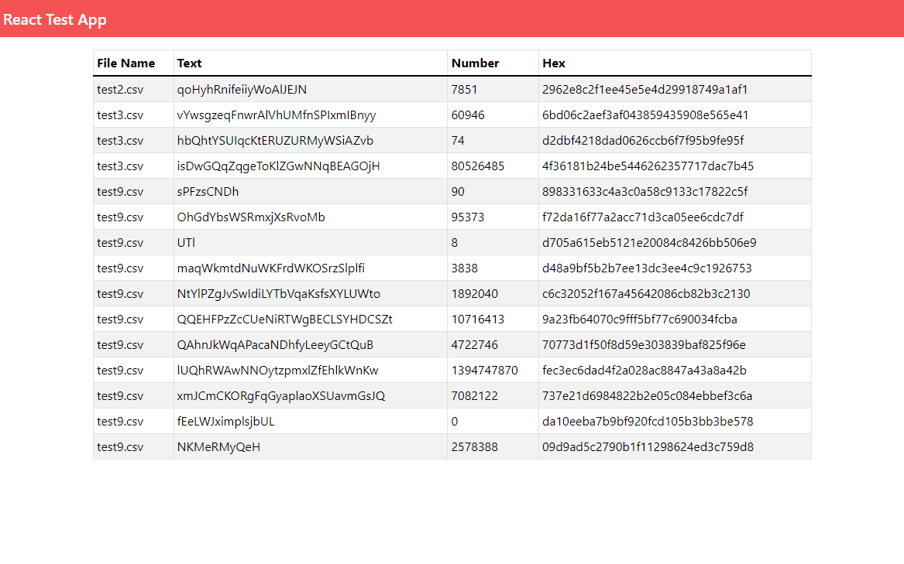

# Full Stack JS - Code Challenge 

This application is part of a Full Stack Javascript challenge, consisting on an API built using Node.js, and a client built with React.js. 

## Screenshot



## Run Locally

Create an empty directory and clone the project

```bash
  git clone [https://link-to-project](https://github.com/jsepic89/challenge-toolbox)
```

## Installation

1. Go to the project directory
2. Run the docker compose file and the dependencies will be installed automatically.

```bash
docker-compose up
```

## Usage

Note that npm start is already performed inside the server Dockerfile.
URL is http://localhost:3000/ 

## Running Tests

To run tests:

```bash
npm test
```
